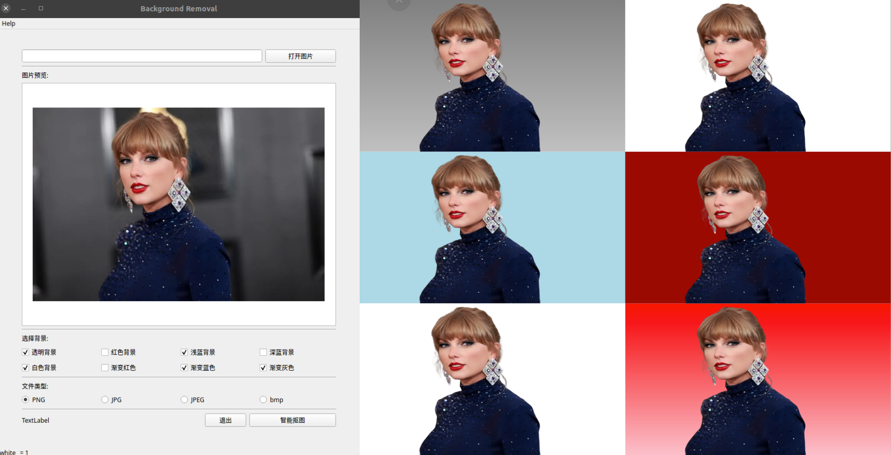

# remove-background-ui

User Interface for Photo Background Removal and color filling.

## Introduction

This project provides a user interface based on the removebg library to remove backgrounds from input photos and fill the background with different colors.



## Usage

1. Get an API key from: [remove.bg API](https://www.remove.bg/api) and paste it into Line 14 of [main.py](./main.py)

2. Set up Python envrionment like this:

```bash
conda create --name rmbg python=3.8 -y
conda activate rmbg
conda install anaconda::pyqt
pip install removebg
pip install pillow
```

3. To launch the UI, run: `python main.py`
4. Select your needed features from UI, the generated pics can be found from [pics](./pics/)


## Others

This is a trial project. Contributions for new features are welcome!